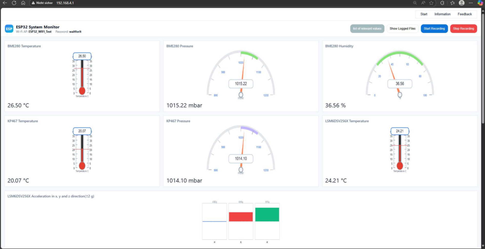
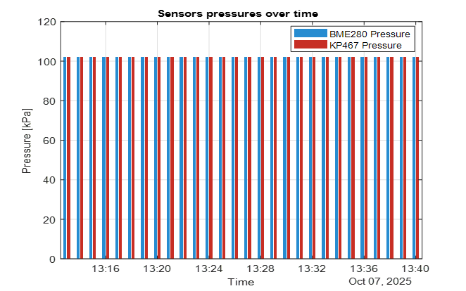

# Automotive Wireless Sensor Prototyping Kit

> Master's thesis  
> University of Bremen  
> Developed in collaboration with HELLA (FORVIA)

## Overview

This repository presents an overview of an ESP32-based automotive wireless sensor prototyping platform. The project focused on sensor integration, CAN communication, embedded web monitoring, SD card logging, firmware validation, and MATLAB-based data analysis.

Actual source code, detailed firmware architecture, PCB design files, and proprietary implementation details are not included due to confidentiality agreements.

## Key Features

- ESP32-based embedded firmware
- Pressure, environmental, and IMU sensor integration
- CAN communication
- Embedded HTTP web server
- Wi-Fi dashboard for live monitoring
- SD card data logging
- MATLAB-based offline data analysis
- Firmware validation workflow
----

## System Workflow

A simplified workflow of the embedded platform is available here:

[System Workflow](docs/system_workflow.md)

## Embedded Web Dashboard

The ESP32 hosts an embedded HTTP web server for live monitoring of pressure, temperature, humidity, and acceleration data through a browser-based dashboard.

## Pressure Sensor Validation

The pressure analysis compares sensor readings under static laboratory conditions and demonstrates stable data acquisition from the integrated sensing platform.

## Firmware Validation

A short summary of the firmware validation workflow is available here:

[Firmware Validation Summary](docs/firmware_test_summary.md)

## Project Outcome

The prototype demonstrated:

- Reliable multi-sensor acquisition
- CAN-based communication
- Embedded web-based monitoring
- SD card data logging
- MATLAB-supported offline analysis
- Firmware validation under laboratory conditions

## Skills Demonstrated

- Embedded C/C++ firmware development
- ESP32 development
- Sensor integration
- CAN communication
- Embedded HTTP web server
- Wi-Fi-based monitoring
- SD card logging
- MATLAB data analysis
- Firmware testing and validation
- Technical documentation

## Confidentiality Notice

This repository is intentionally sanitized. It does not include production firmware, full source code, detailed hardware schematics, proprietary CAN definitions, calibration logic, or internal company-specific implementation details.

## Author

**Syeda Tajkia Zareen**

M.Sc. Communication and Information Technology  
University of Bremen
