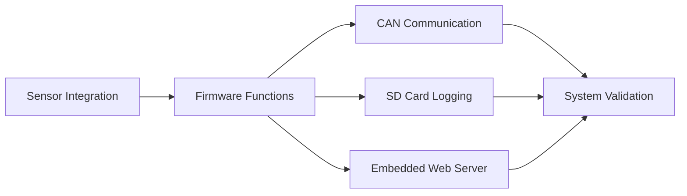

# Firmware Validation Summary

The embedded firmware was functionally verified to ensure reliable operation of the developed prototype.

## Verified Features

- ✅ Sensor Integration
- ✅ CAN Communication
- ✅ SD Card Data Logging
- ✅ Embedded Web Server
- ✅ Wi-Fi Dashboard
- ✅ Threshold-Based Logic

> *Detailed test procedures and implementation are omitted due to confidentiality agreements with HELLA (FORVIA).*
