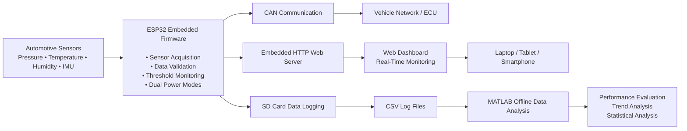

# System Workflow

The following diagram presents a simplified overview of the embedded firmware workflow developed during the project. It illustrates the major functional blocks without exposing proprietary implementation details.

## Functional Description

1. Multiple automotive sensors continuously provide real-time measurements.

2. The ESP32 firmware acquires sensor data, validates measurements, applies threshold-based logic, and manages system operation.

3. Processed data are simultaneously:
   - transmitted through the CAN interface,
   - stored locally on an SD card,
   - published through an embedded HTTP web server.

4. The embedded web dashboard enables wireless monitoring from any device connected to the same network.

5. Logged sensor data are analyzed offline in MATLAB to evaluate sensor performance, system behavior, and measurement quality.

> **Note:** This workflow is intentionally simplified. Detailed firmware architecture and implementation are omitted to comply with confidentiality agreements established during the collaboration with HELLA (FORVIA).
